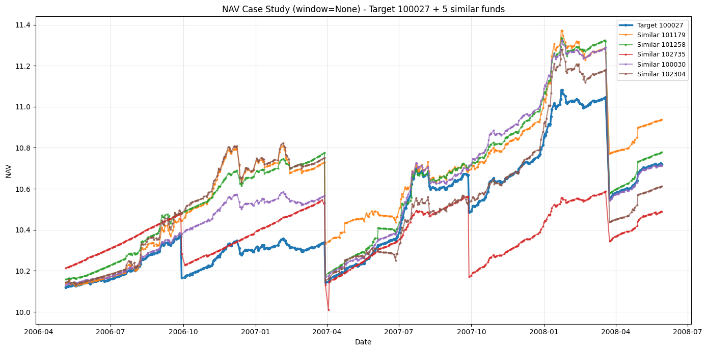
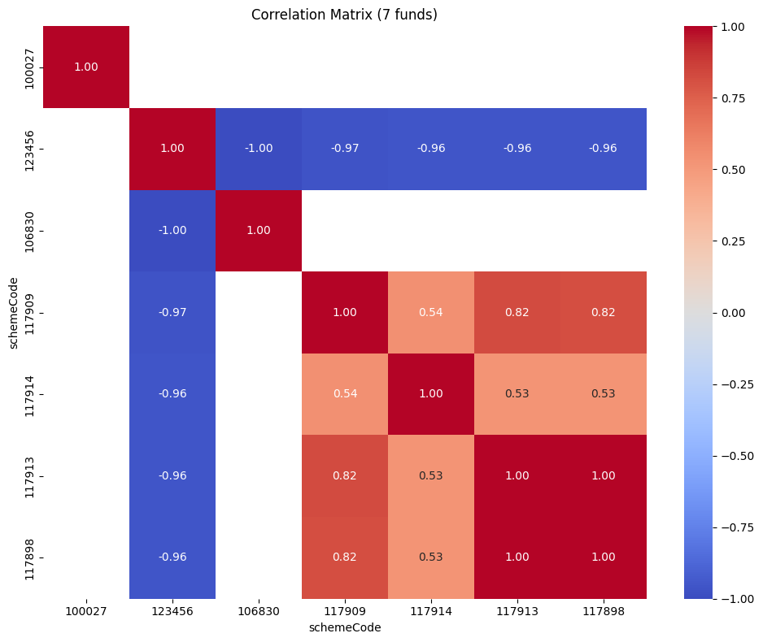
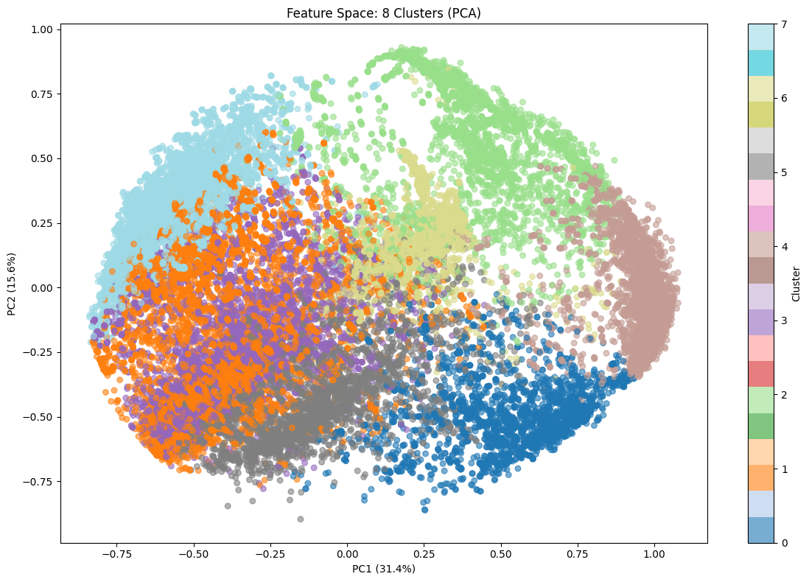
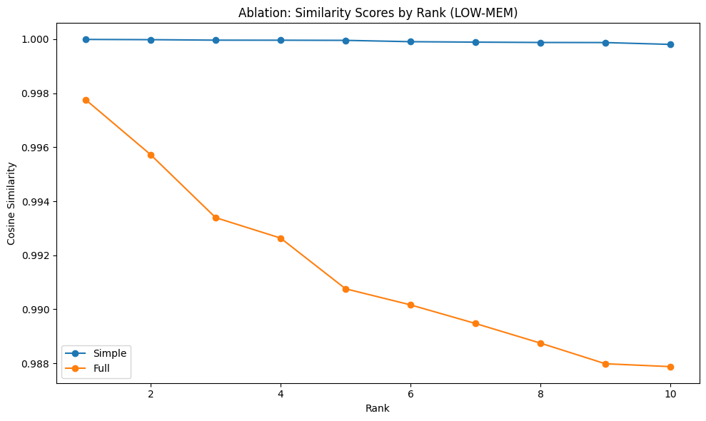

# Mutual Funds Recommendation (Low-Memory Pipeline)

This project builds a **memory-efficient mutual fund analytics and recommendation system** from NAV history, then produces:
- top similar funds (cosine similarity in feature space)
- diversification candidates (low-correlation funds)
- risk-aware ranking and clustering
- ablation comparison between simple vs full feature sets

The latest implementation is in **`model2.ipynb`**.

---

## What changed in the new approach

The updated notebook uses a low-memory, production-style pipeline:

1. **Load only required columns** from `final_data.csv`.
2. **Clean + optimize dtypes** (`int32`, `float32`, `category`) via `prepare_nav_df_lowmem`.
3. **Compute returns efficiently** using grouped transformations (`add_returns_lowmem`).
4. **Build robust fund-level features** (`compute_fund_features_lowmem`), including:
   - CAGR, annualized volatility, Sharpe, Sortino
   - max drawdown, ulcer index, VaR/CVaR
   - skew, kurtosis, trend slope of log NAV
5. **Incorporate precomputed technical columns** if present (`aggregate_precomputed_features_lowmem`).
6. **Normalize and vectorize** features (`fit_feature_matrix`) for fast cosine similarity.
7. **Generate recommendations + diagnostics**:
   - Similar fund retrieval (`recommend_similar_topk`)
   - Diversification proxy (`recommend_diversifiers_proxy`)
   - PCA + KMeans visualization (`plot_feature_space_clusters`)
   - Full case report (`case_study_report`)
   - Ablation analysis (`ablation_similarity_comparison_lowmem`)

---

## Visual results from the updated notebook

### 1) NAV Case Study (Target vs Similar Funds)

Shows the target fund NAV trajectory against its top similar funds.

---

### 2) Correlation Matrix (Portfolio + Candidates)

Used to evaluate diversification quality (prefer lower correlation with current portfolio exposure).

---

### 3) Feature Space Clusters (PCA)

Projects high-dimensional features to 2D and groups funds into clusters for structural understanding.

---

### 4) Ablation Study (Simple vs Full Features)

Compares recommendation behavior between:
- **Simple model:** core risk-return features
- **Full model:** enriched feature set including tail risk/trend/precomputed indicators

---

